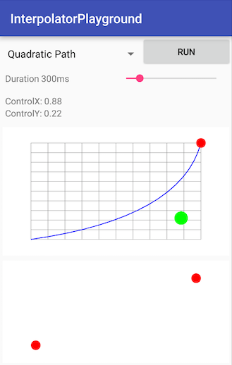

#Interpolator Playground

This application shows how the various Interpolator implementations in the platform work.
You can vary the duration of the animation as well as the constructor parameters of any
of the variable interpolators and use the values in the UI to inform how to write
your code that uses that interpolator. Changes to the animation parameters will
be reflected dynamically in the blue curve and running the animation will
show the animation in action (with the red circles on the curve as well as
in the open area at the bottom).

 To use:
 * Select any of the built-in interpolators from the drop-down list at the top
 * Use the slider(s) to change the animation duration and/or any of the variable
 parameters for the selected interpolator
 * For Quadratic and Cubic Path interpolators, drag the green handle(s) to position
 the control points of the curve
 * Click the 'Run' button to see the animation in action
 * Note the values of the duration and other parameters to use in your
 animation code

