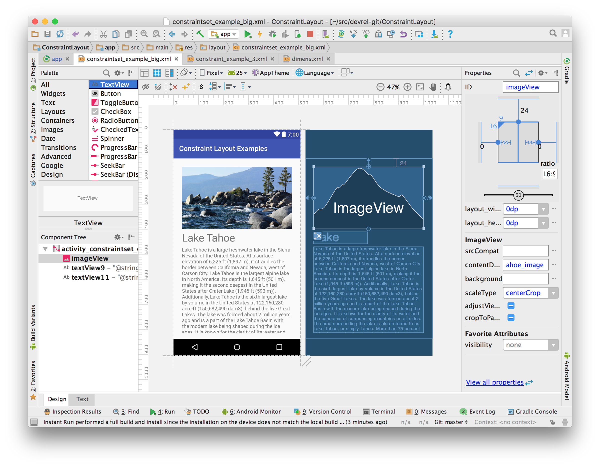
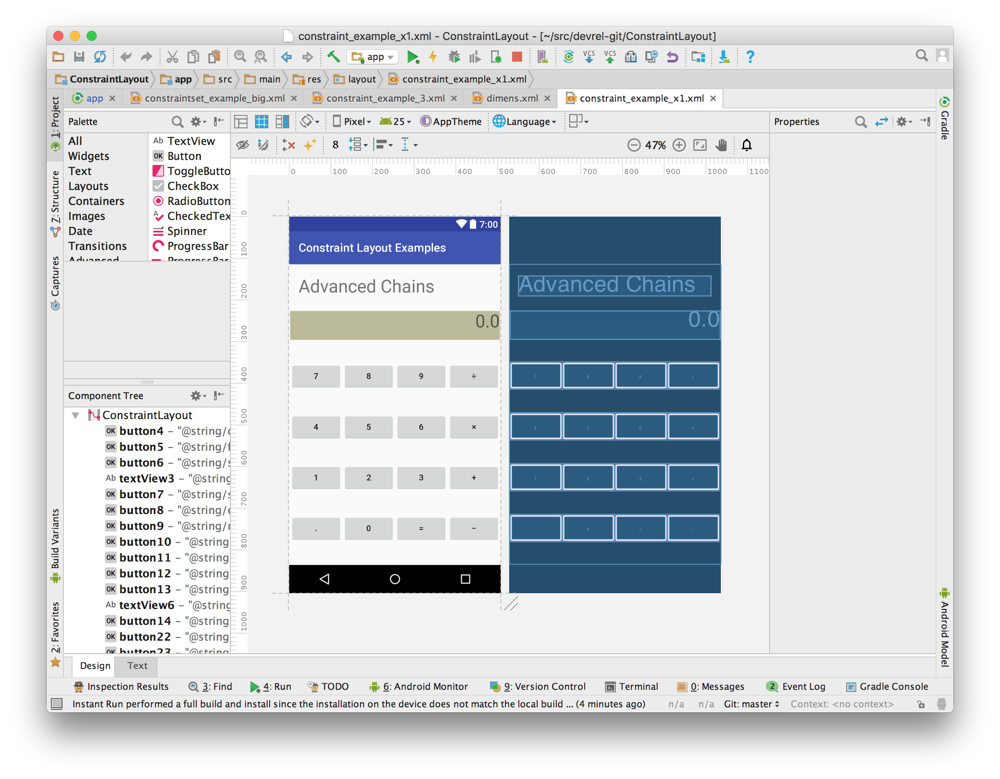

MotionLayout / Constraint Layout Samples
=========================
This repository contains a list of layouts that showcases the various features and usage of
[ConstraintLayout](https://developer.android.com/reference/android/support/constraint/ConstraintLayout.html) and 
[MotionLayout](https://developer.android.com/reference/android/support/constraint/motion/MotionLayout)

Pre-requisites
--------------
- Android Studio 3.3+
- Constraint Layout library 2.0.0-alpha5+

Getting Started
---------------
Import the project using Android Studio. Navigate to the app>res>layout> and open one of the layouts
in the layout editor. This sample is best understood by seeing the constraints in the Design mode
of the layout editor.

MotionLayout samples overview
-----------------------------

|  Title  |  GIF  | Layout | MotionScene | 
| :----: | :----: | :----: | :----: |
|  Basic Example (1/3) |  | [Layout](motionlayout/src/main/res/layout/motion_01_basic.xml) | [MotionScene](motionlayout/src/main/res/xml/scene_01.xml) | 
|  Basic Example (2/3) |  | [Layout](motionlayout/src/main/res/layout/motion_02_basic.xml) | [MotionScene](motionlayout/src/main/res/xml/scene_02.xml) | 
|  Basic Example (3/3) |  | [Layout](motionlayout/src/main/res/layout/motion_02_basic_autocomplete_false.xml) | [MotionScene](motionlayout/src/main/res/xml/scene_02_autocomplete_false.xml) | 
|  Custom Attribute |  | [Layout](motionlayout/src/main/res/layout/motion_03_custom_attribute.xml) | [MotionScene](motionlayout/src/main/res/xml/scene_03.xml) | 
|  ImageFilterView (1/2) |  | [Layout](motionlayout/src/main/res/layout/motion_04_imagefilter.xml) | [MotionScene](motionlayout/src/main/res/xml/scene_04.xml) | 
|  ImageFilterView (2/2) |  | [Layout](motionlayout/src/main/res/layout/motion_05_imagefilter.xml) | [MotionScene](motionlayout/src/main/res/xml/scene_05.xml) | 
|  Keyframe Position (1/3) |  | [Layout](motionlayout/src/main/res/layout/motion_06_keyframe.xml) | [MotionScene](motionlayout/src/main/res/xml/scene_06.xml) | 
|  Keyframe Interpolation (2/3) |  | [Layout](motionlayout/src/main/res/layout/motion_07_keyframe.xml) | [MotionScene](motionlayout/src/main/res/xml/scene_07.xml) | 
|  Keyframe Cycle (3/3) |  | [Layout](motionlayout/src/main/res/layout/motion_08_cycle.xml) | [MotionScene](motionlayout/src/main/res/xml/scene_08.xml) | 
|  CoordinatorLayout Example (1/3) |  | [Layout](motionlayout/src/main/res/layout/motion_09_coordinatorlayout.xml) | [MotionScene](motionlayout/src/main/res/xml/scene_09.xml) | 
|  CoordinatorLayout Example (2/3) |  | [Layout](motionlayout/src/main/res/layout/motion_10_coordinatorlayout.xml) | [MotionScene](motionlayout/src/main/res/xml/scene_10.xml) | 
|  CoordinatorLayout Example (3/3) |  | [Layout](motionlayout/src/main/res/layout/motion_11_coordinatorlayout.xml) | [MotionScene](motionlayout/src/main/res/xml/scene_11_header.xml) | 
|  DrawerLayout Example (1/2) |  | [Layout](motionlayout/src/main/res/layout/motion_12_drawerlayout.xml) | [MotionScene](motionlayout/src/main/res/xml/scene_12_content.xml) | 
|  DrawerLayout Example (2/2) |  | [Layout](motionlayout/src/main/res/layout/motion_13_drawerlayout.xml) | [Content](motionlayout/src/main/res/xml/scene_12_content.xml)   [Menu](motionlayout/src/main/res/xml/scene_13_menu.xml)| 
|  Side Panel Example |  | [Layout](motionlayout/src/main/res/layout/motion_14_side_panel.xml) | [MotionScene](motionlayout/src/main/res/xml/scene_14.xml) | 
|  Parallax Example |  | [Layout](motionlayout/src/main/res/layout/motion_15_parallax.xml) | [MotionScene](motionlayout/src/main/res/xml/scene_15.xml) | 
|  ViewPager Example |  | [Layout](motionlayout/src/main/res/layout/motion_16_viewpager.xml) | [MotionScene](motionlayout/src/main/res/xml/scene_15.xml) | 
|  ViewPager Lottie Example |  | [Layout](motionlayout/src/main/res/layout/motion_23_viewpager.xml) | [MotionScene](motionlayout/src/main/res/xml/scene_23.xml) | 
|  Complex Motion Example (1/4) |  | [Layout](motionlayout/src/main/res/layout/motion_17_coordination.xml) | [MotionScene](motionlayout/src/main/res/xml/scene_17.xml) | 
|  Complex Motion Example (2/4) |  | [Layout](motionlayout/src/main/res/layout/motion_18_coordination.xml) | [MotionScene](motionlayout/src/main/res/xml/scene_18.xml) | 
|  Complex Motion Example (3/4) |  | [Layout](motionlayout/src/main/res/layout/motion_19_coordination.xml) | [MotionScene](motionlayout/src/main/res/xml/scene_19.xml) | 
|  Complex Motion Example (4/4) | N/A | [Layout](motionlayout/src/main/res/layout/motion_20_reveal.xml) | [MotionScene](motionlayout/src/main/res/xml/scene_20.xml) | 
|  Fragment Transition Example (1/2) |  | [Layout](motionlayout/src/main/res/layout/main_activity.xml) | [MotionScene](motionlayout/src/main/res/xml/main_scene.xml) |
|  Fragment Transition Example (2/2) |  | [Layout](motionlayout/src/main/res/layout/main_activity.xml) | [MotionScene](motionlayout/src/main/res/xml/main_scene.xml) |  
|  YouTube like motion Example |  | [Layout](motionlayout/src/main/res/layout/motion_24_youtube.xml) | [MotionScene](motionlayout/src/main/res/xml/scene_24.xml) |  
|  Example using KeyTrigger |  | [Layout](motionlayout/src/main/res/layout/motion_25_keytrigger.xml) | [MotionScene](motionlayout/src/main/res/xml/scene_25.xml) |  
|  Example using Multi State |  | [Layout](motionlayout/src/main/res/layout/motion_26_multistate.xml) | [MotionScene](motionlayout/src/main/res/xml/scene_26.xml) |  

ConstraintLayout samples screenshots
------------

Support
-------
If you've found an error in this sample, please file an issue:
https://github.com/android/views-widgets/issues

To learn more about ConstraintLayout checkout the
[Constraint Layout Training Guide](https://developer.android.com/training/constraint-layout/index.html)

Patches are encouraged, and may be submitted by forking this project and
submitting a pull request through GitHub. Please see the [contributing guidelines](CONTRIBUTING.md) for more details.
