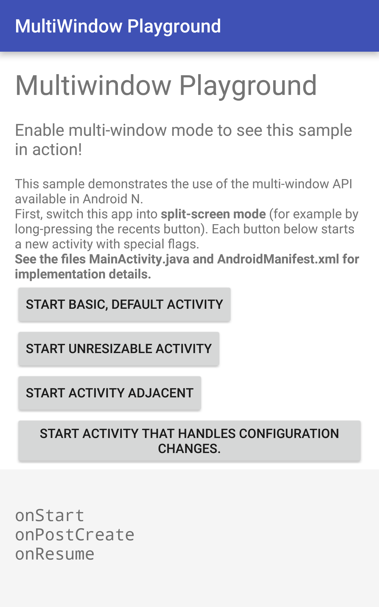

Android MultiWindowPlayground Sample (Kotlin)
=============================================

This sample demonstrates the use of the multi-window API available
in Android N. It shows the use of new Intent flags and
AndroidManifest properties to define the multi-window behavior.
Switch the sample app into multi-window mode to see how it affects
the lifecycle and behavior of the app.

Introduction
------------

Android N introduces new APIs to support multiple activities
to be displayed at the same time.

Activities that are started within the same task stack
inherit their multiwindow properties from the activity that fired
off the intent. The following features are available when an activity
has been launched into a new task stack.

An activity can be set as not resizable through the
`android:resizableActivity` property in the AndroidManifest. All
applications targeting Android N or above are resizable by default.

In split-screen mode, an activity can be started adjacent to the
launching activity by setting the
`Intent.FLAG_ACTIVITY_LAUNCH_TO_ADJACENT` flag in its intent.

Sometimes activities may choose to handle configuration changes
themselves (for example for games or OpenGL-based applications). In this
case, setting
`android:configChanges=screenSize|smallestScreenSize|screenLayout|orientation`
in the AndroidManifest definition of the activity enables callbacks for
all configuration changes that may occur during multi-window use for the
Activity. See [Handling Runtime Changes][1].

In freeform mode (where applications can be freely resized), activities
can be started within a certain area of the screen using the
`ActivityOptions#setLaunchBounds` call.

Alternatively, the preferred and minimum sizes can be set in a new
`layout` property in the AndroidManifest.

[1]: https://developer.android.com/guide/topics/resources/runtime-changes.html

Pre-requisites
--------------

- Android SDK 27
- Android Support Repository

Screenshots
-------------

Getting Started
---------------

This sample uses the Gradle build system. To build this project, use the
"gradlew build" command or use "Import Project" in Android Studio.

Support
-------

- Google+ Community: https://plus.google.com/communities/105153134372062985968
- Stack Overflow: http://stackoverflow.com/questions/tagged/android

If you've found an error in this sample, please file an issue:
https://github.com/googlesamples/android-MultiWindowPlayground

Patches are encouraged, and may be submitted by forking this project and
submitting a pull request through GitHub. Please see CONTRIBUTING.md for more details.

License
-------

Copyright 2017 The Android Open Source Project, Inc.

Licensed to the Apache Software Foundation (ASF) under one or more contributor
license agreements.  See the NOTICE file distributed with this work for
additional information regarding copyright ownership.  The ASF licenses this
file to you under the Apache License, Version 2.0 (the "License"); you may not
use this file except in compliance with the License.  You may obtain a copy of
the License at

http://www.apache.org/licenses/LICENSE-2.0

Unless required by applicable law or agreed to in writing, software
distributed under the License is distributed on an "AS IS" BASIS, WITHOUT
WARRANTIES OR CONDITIONS OF ANY KIND, either express or implied.  See the
License for the specific language governing permissions and limitations under
the License.
