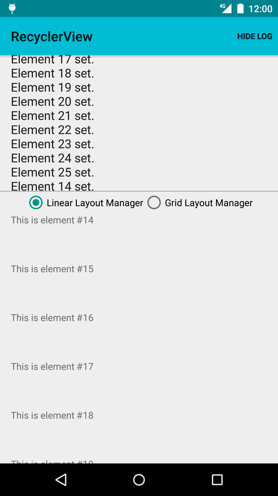
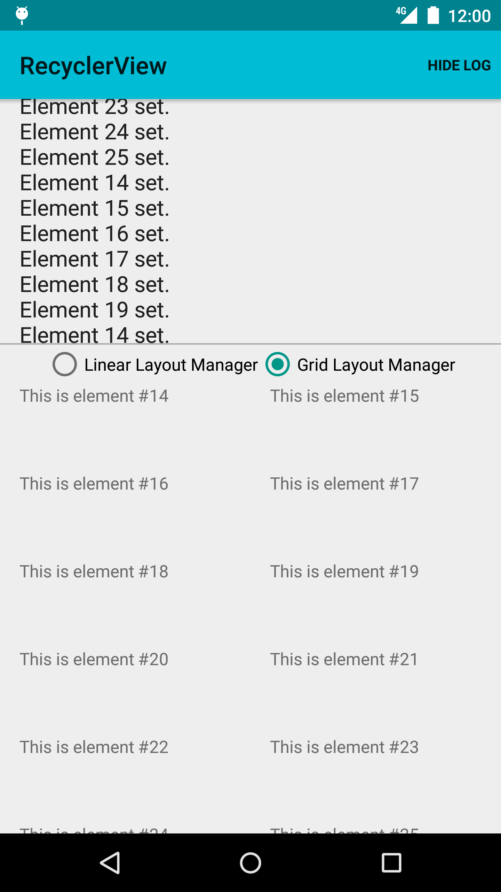

Android RecyclerView Sample
===================================

Sample demonstrating the use of RecyclerView to layout elements with a
LinearLayoutManager and with a GridLayoutManager. It also demonstrates
how to handle touch events on elements.

Introduction
------------

Sample demonstrating the use of [RecyclerView][1] to layout elements with a
[LinearLayoutManager][2] or with a [GridLayoutManager][3].

[RecyclerView][1] can display large datasets that can be scrolled
efficiently by recycling a limited number of views. Click listeners can be
defined when [ViewHolder][4] views are instantiated. [RecyclerView][1] is
available in the v7 Support Library, thus compatible with API level 7 and above.

Tap "Show Log" menu item to display log of elements as they are laid out and
tapped. Use radio buttons to toggle between [LinearLayoutManager][2] and
[GridLayoutManager][3].

[1]: https://developer.android.com/reference/android/support/v7/widget/RecyclerView.html
[2]: https://developer.android.com/reference/android/support/v7/widget/LinearLayoutManager.html
[3]: https://developer.android.com/reference/android/support/v7/widget/GridLayoutManager.html
[4]: https://developer.android.com/reference/android/support/v7/widget/RecyclerView.ViewHolder.html

Pre-requisites
--------------

- Android SDK 28
- Android Build Tools v28.0.3
- Android Support Repository

Screenshots
-------------

  

Getting Started
---------------

This sample uses the Gradle build system. To build this project, use the
"gradlew build" command or use "Import Project" in Android Studio.

Support
-------

- Stack Overflow: http://stackoverflow.com/questions/tagged/android

If you've found an error in this sample, please file an issue:
https://github.com/android/views-widgets

Patches are encouraged, and may be submitted by forking this project and
submitting a pull request through GitHub. Please see CONTRIBUTING.md for more details.
