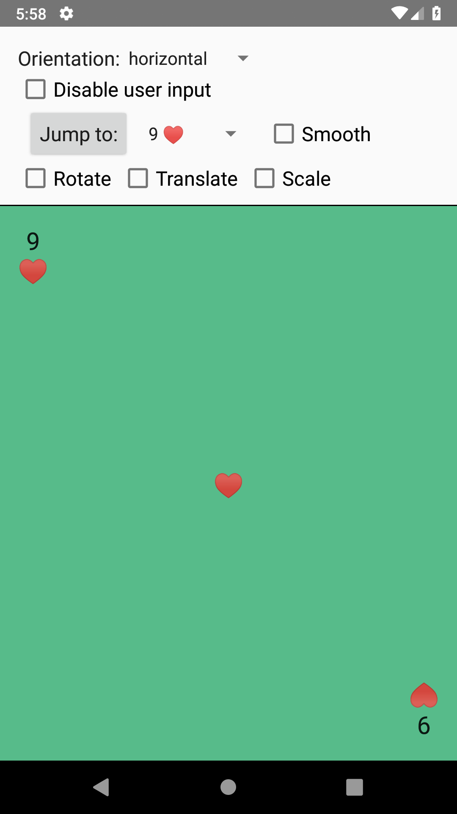
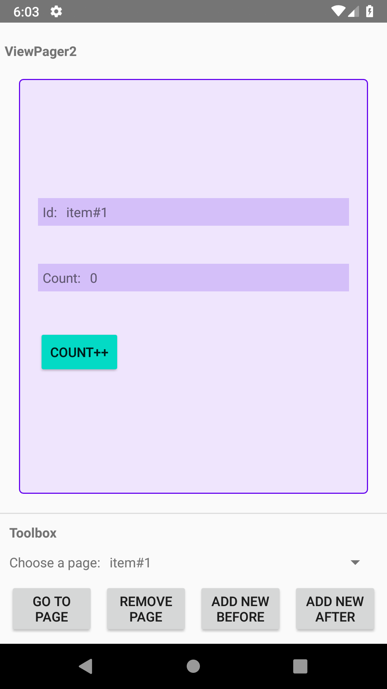
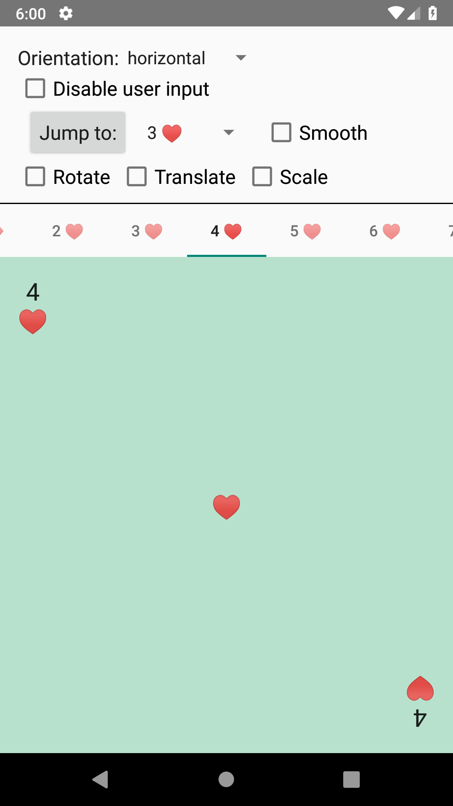

ViewPager2 samples
==================
This sample shows how to use [ViewPager2](https://developer.android.com/reference/androidx/viewpager2/widget/ViewPager2)
with either Views or Fragments as pages, how to perform page transformations, how to link ViewPager2 to a TabLayout, and demonstrates
handling modifications of an underlying page adapter collection.

ViewPager2 is the replacement of [ViewPager](https://developer.android.com/reference/androidx/viewpager/widget/ViewPager),
addressing most of its predecessor's pain-points, including right-to-left layout support, vertical orientation and
modifiable Fragment collections.

### Samples

* ViewPager2 with Views - shows how to set up a ViewPager2 with Views as pages
* ViewPager2 with Fragments - shows how to set up a ViewPager2 with Fragments as pages
* ViewPager2 with a Mutable Collection (Views) - demonstrates usage of ViewPager2 with Views as pages and mutations in a page adapter
* ViewPager2 with a Mutable Collection (Fragments) - demonstrates usage of ViewPager2 with Fragments as pages, and mutations in a page adapter
* ViewPager2 with a TabLayout (Views) - shows how to set up a ViewPager2 with Views as pages, and link it to a TabLayout

Getting Started
---------------

### Setting up ViewPager2

Just like ViewPager, ViewPager2 needs an adapter to populate it with pages. Any
[RecyclerView.Adapter](https://developer.android.com/reference/androidx/recyclerview/widget/RecyclerView.Adapter) will
suffice for simple use cases, when your pages do not have state that needs to be maintained across the Activity lifecycle.
The top level View that you will inflate for your pages must have its `layout_width` and `layout_height` set to
`match_parent`. If your pages do need to save state across lifecycles, make your adapter implement the
[StatefulAdapter](https://developer.android.com/reference/androidx/viewpager2/adapter/StatefulAdapter) interface, or
manage your own state saving (e.g., using [ViewModel](https://developer.android.com/topic/libraries/architecture/viewmodel)).

A simple stateless example can be found in
[CardViewActivity](app/src/main/java/androidx/viewpager2/integration/testapp/CardViewActivity.kt).

### Using Fragments as pages

If you want to use Fragments instead of simple Views for your pages, have your adapter extend
[FragmentStateAdapter](https://developer.android.com/reference/androidx/viewpager2/adapter/FragmentStateAdapter). In
it, simply return a new Fragment in its
[getItem](https://developer.android.com/reference/androidx/viewpager2/adapter/FragmentStateAdapter.html#getItem(int))
method. The FragmentStateAdapter implements StatefulAdapter, so your fragments are automatically a part of the lifecycle.
Implement their
[onSaveInstanceState](https://developer.android.com/reference/androidx/fragment/app/Fragment#onSaveInstanceState(android.os.Bundle))
as you would do normally.

You can find an example of stateless Fragments in
[CardFragmentActivity](app/src/main/java/androidx/viewpager2/integration/testapp/CardFragmentActivity.kt),
and of stateful Fragments in
[MutableCollectionFragmentActivity](app/src/main/java/androidx/viewpager2/integration/testapp/MutableCollectionFragmentActivity.kt).

### Working with TabLayout

With the original ViewPager, you were able to link it to a TabLayout by using TabLayout's
[setupWithViewPager](https://developer.android.com/reference/android/support/design/widget/TabLayout.html#setupWithViewPager(android.support.v4.view.ViewPager)).
With ViewPager2, the integration comes in the form of
[TabLayoutMediator](https://developer.android.com/reference/com/google/android/material/tabs/TabLayoutMediator).
Simply create an instance of this class, pass an implementation of its `OnConfigureTabCallback` to the constructor, and
call `attach()` when you've set your ViewPager2's adapter.

You can find an example of a ViewPager2 that's linked to a TabLayout in
[CardViewTabLayoutActivity](app/src/main/java/androidx/viewpager2/integration/testapp/CardViewTabLayoutActivity.kt).

Testing
-------

Performing UI tests on a ViewPager can be done by performing swipes on the
ViewPager element, or by calling setCurrentItem on the ViewPager directly.
Examples can be found in
[ViewPagerTest](app/src/androidTest/java/androidx/viewpager2/integration/testapp/test/ViewPagerBaseTest.kt),
[MutableCollectionTest](app/src/androidTest/java/androidx/viewpager2/integration/testapp/test/MutableCollectionBaseTest.kt) and
[TabLayoutTest](app/src/androidTest/java/androidx/viewpager2/integration/testapp/test/TabLayoutTest.kt).

If you need to wait until a swipe or page transition has finished, there are two
strategies you can employ: create an IdlingResource that is idle whenever the
ViewPager's scroll state is idle, or create a CountDownLatch that counts down
when ViewPager2 transitions to idle. An example of an IdlingResource has been
implemented in
[ViewPagerIdleWatcher](app/src/androidTest/java/androidx/viewpager2/integration/testapp/test/util/ViewPagerIdleWatcher.kt).

Some useful Espresso extensions can be found in
[ViewInteractions](app/src/androidTest/java/androidx/viewpager2/integration/testapp/test/util/ViewInteractions.kt) and
[ViewPagerActions](app/src/androidTest/java/androidx/viewpager2/integration/testapp/test/util/ViewPagerActions.kt).

Support
-------
You can report issues on ViewPager2 or the samples from this repository [here](https://issuetracker.google.com/issues?q=componentid:561920).
